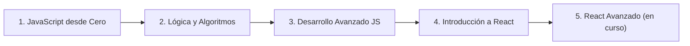

<div align="center">

# JavaScript Sesiones

### De fundamentos a React — 40+ proyectos que demuestran dominio del ecosistema JavaScript

[](./JavaScript-desde-Cero)
[](./Introduccion-A-React)
[](./Desarrollo-Avanzado-Javascript)
[](./Desarrollo-Avanzado-Javascript/clase_8)
[](./Introduccion-A-React/clase_7)
[](./Desarrollo-Avanzado-Javascript/clase_6)


**Autores:** [JoseBenin82](https://github.com/JoseBenin82) · **Programa:** DEV.F  
📅 40+ archivos de práctica · 13 proyectos funcionales · 5 módulos progresivos

</div>

---

## 📌 Para reclutadores técnicos

Este repositorio demuestra competencia comprobable en el stack前端 moderno. Cada módulo aborda un nivel de profundidad creciente:

| Competencia | Dónde se demuestra |
|-------------|-------------------|
| **DOM API & Eventos** | [`JavaScript-desde-Cero/clase_6-8`](./JavaScript-desde-Cero) — Manipulación del DOM, generador de contraseñas, consumo de API REST |
| **ES6+ Moderno** | [`Logica y Algoritmos/clase_1`](./Logica%20y%20Algoritmos/clase_1) — Destructuring, arrow functions, promesas, symbols |
| **Algoritmos clásicos** | [`Logica y Algoritmos/clase_4-7`](./Logica%20y%20Algoritmos) — Two Pointers, Sliding Window, Recursión, Binary Search, Divide & Conquer |
| **Asincronía (Callbacks, Promises, Async/Await)** | [`Desarrollo-Avanzado-Javascript/clase_1-4`](./Desarrollo-Avanzado-Javascript) — Event Loop, Fetch vs Axios, promesas encadenadas |
| **Validación con esquemas (Zod)** | [`Desarrollo-Avanzado-Javascript/clase_6`](./Desarrollo-Avanzado-Javascript/clase_6/ValidaciónFormulariosZod) — Schemas, parse, errores tipados |
| **Node.js básico (fs, JSON, CLI)** | [`Desarrollo-Avanzado-Javascript/clase_7`](./Desarrollo-Avanzado-Javascript/clase_7/IntroNode) · [`Logica y Algoritmos/clase_8`](./Logica%20y%20Algoritmos/clase_8) |
| **Componentes React & Props** | [`Introduccion-A-React/clase_1-2`](./Introduccion-A-React) — Tarjeta de presentación, CRUD lista de compras |
| **Estado, eventos, renderizado condicional** | [`Introduccion-A-React/clase_3-5`](./Introduccion-A-React) — Contador, juego de adivinanzas, composición |
| **Hooks avanzados (useMemo, useEffect)** | [`Introduccion-A-React/clase_6`](./Introduccion-A-React/clase_6/ProyectoHooksAvanzados) — Tabla de inventario, panel de estadísticas |
| **React Router, layouts, auth simulada** | [`Introduccion-A-React/clase_7-8`](./Introduccion-A-React) — SPA multi-ruta, contexto de autenticación, rutas protegidas |
| **Integración con APIs REST** | Rick & Morty ([Fetch + Axios](./Desarrollo-Avanzado-Javascript/clase_03)), Open Library ([fetch](./JavaScript-desde-Cero/clase_8)) |
| **Vite como bundler** | Proyectos en todas las clases de React y [`clase_8`](./Desarrollo-Avanzado-Javascript/clase_8) |

---

## 👤 Para reclutadores no técnicos

> **¿Qué hay aquí?**  
> Una colección de proyectos que muestran cómo una persona pasa de *no saber nada de programación* a *construir aplicaciones web completas* usando JavaScript y React.

**En concreto:**
- 13 proyectos funcionales que puedes abrir en un navegador
- Una app tipo Twitter (Chirp) con login, perfiles y publicaciones
- Un sistema de citas médicas con múltiples pantallas
- Juegos, generadores de contraseñas, exploradores de APIs
- Todo construido con las herramientas que usan empresas como Netflix, Airbnb y Facebook

---

## 🧭 Ruta de aprendizaje



---

## 📦 Módulos

| Módulo | Clases | Temas |
|--------|------|-------|
| [**JavaScript desde Cero**](./JavaScript-desde-Cero) | 8 | Tipos, operadores, condicionales, loops, arreglos, funciones, objetos, DOM, consumo de APIs |
| [**Lógica y Algoritmos**](./Logica%20y%20Algoritmos) | 8 | ES6+, Dos punteros, Ventana deslizante, Recursión, Divide & Vencerás, Búsqueda binaria |
| [**Desarrollo Avanzado JS**](./Desarrollo-Avanzado-Javascript) | 8 | Event Loop, Callbacks, Fetch vs Axios, Promesas, Formularios, Zod, Node.js, Vite |
| [**Introducción a React**](./Introduccion-A-React) | 8 | Componentes, Props, Estado, Eventos, Renderizado condicional, Hooks, Router, Context, Autenticación |
| [**React Avanzado**](./React%20Avanzado) | — | En desarrollo |

---

## 🗂️ Estructura del repositorio

```
JavaScript-Sesiones/
├── JavaScript-desde-Cero/          # Fundamentos del lenguaje
│   ├── clase_1/                    # Tipos de datos
│   ├── clase_2/                    # Operadores y condicionales
│   ├── clase_3/                    # Arreglos y ciclos
│   ├── clase_4/                    # Funciones
│   ├── clase_5/                    # Objetos
│   ├── clase_6/                    # Introducción al DOM
│   ├── clase_7/                    # Generador de contraseñas
│   └── clase_8/                    # Librería de libros (API)
│
├── Logica y Algoritmos/            # Pensamiento computacional
│   ├── clase_1/                    # ES6 Moderno
│   ├── clase_2/                    # Algoritmo lista de compras
│   ├── clase_3/                    # Métodos avanzados de arreglos
│   ├── clase_4/                    # Two Pointers
│   ├── clase_5/                    # Sliding Window
│   ├── clase_6/                    # Recursión
│   ├── clase_7/                    # Divide & Conquer
│   └── clase_8/                    # Gestor de notas (Node.js)
│
├── Desarrollo-Avanzado-Javascript/ # JS asíncrono y herramientas
│   ├── clase_1/                    # Event Loop (cafetería)
│   ├── clase_2/                    # Callbacks y JSON
│   ├── clase_03/                   # Fetch vs Axios (Rick & Morty)
│   ├── clase_4/                    # Promesas y Async/Await
│   ├── clase_5/                    # Formularios con validación
│   ├── clase_6/                    # Validación con Zod
│   ├── clase_7/                    # Introducción a Node.js
│   └── clase_8/                    # Proyectos con Vite
│
├── Introduccion-A-React/           # El mundo de React
│   ├── clase_1/                    # Tarjeta de presentación
│   ├── clase_2/                    # Lista de compras (CRUD)
│   ├── clase_3/                    # Contador de tareas
│   ├── clase_4/                    # Componentes y composición
│   ├── clase_5/                    # Juego de adivinanzas
│   ├── clase_6/                    # Hooks avanzados (inventario)
│   ├── clase_7/                    # Gestión de citas médicas (Router)
│   └── clase_8/                    # Chirp (Twitter Clone)
│
├── React Avanzado/                 # React a profundidad
│   └── (próximamente)
│
└── README.md
```

---

## 🏆 Proyectos destacados

### Nivel 3 — Aplicaciones complejas

| Proyecto | Descripción | Tecnologías |
|----------|------------|-------------|
| [**Chirp**](Introduccion-A-React/clase_8/Proyecto) | Clon de Twitter con autenticación, tweets, perfiles y rutas protegidas. Almacenamiento local con hash SHA-256. | React 19, React Router 7, Context API, SHA-256, localStorage |
| [**Gestión de Citas Médicas**](Introduccion-A-React/clase_7/ManejoDeRutas/GestionCitasMedicas) | SPA completa con login, registro, dashboard, doctores, detalle de citas, layouts anidados y página 404. | React Router v7, Layouts, AuthContext |

### Nivel 2 — Aplicaciones intermedias

| Proyecto | Descripción | Tecnologías |
|----------|------------|-------------|
| [**Inventario con Hooks**](Introduccion-A-React/clase_6/ProyectoHooksAvanzados/Proyecto) | Tabla de inventario con formulario de productos y panel de estadísticas. | useState, useEffect, useMemo |
| [**Juego de Adivinanzas**](Introduccion-A-React/clase_5/RenderingComposition/Conditional) | Juego interactivo de adivinar un número con feedback, intentos e historial. | Renderizado condicional, composición de componentes |
| [**Rick & Morty Explorer**](Desarrollo-Avanzado-Javascript/clase_03/Proyecto%20Fetch%20y%20Axios) | Explorador de personajes usando Fetch y Axios lado a lado. | Fetch API, Axios, REST API |
| [**Restaurant Reservation**](Desarrollo-Avanzado-Javascript/clase_4/ProyectoPromesasAsyncAwait) | Sistema de reservas con operaciones asíncronas simuladas. | Promesas, Async/Await, manejo de errores |
| [**Validación con Zod**](Desarrollo-Avanzado-Javascript/clase_6/ValidaciónFormulariosZod) | Formulario de registro con validación de esquemas en tiempo real. | Zod, validación declarativa, feedback visual |

### Nivel 1 — Proyectos de fundamentos

| Proyecto | Descripción | Tecnologías |
|----------|------------|-------------|
| [**Exploración Espacial**](Desarrollo-Avanzado-Javascript/clase_7/IntroNode/mi-exploracion-espacial) | CLI Node.js que registra planetas favoritos desde un JSON. | Node.js, fs, cowsay |
| [**Password Generator**](JavaScript-desde-Cero/clase_7) | Generador visual de contraseñas seguras con opciones configurables. | DOM API, eventos, lógica de generación |
| [**Book Library**](JavaScript-desde-Cero/clase_8) | Buscador de libros conectado a Open Library API. | fetch, DOM dinámico, API externa |
| [**Gestor de Notas CLI**](Logica%20y%20Algoritmos/clase_8) | CRUD de notas desde terminal con persistencia en JSON. | Node.js, fs, JSON, línea de comandos |
| [**Business Card**](Introduccion-A-React/clase_1/proyecto-intro-react) | Tarjeta de presentación reusable con props. | Componentes funcionales, props |
| [**Lista de Compras CRUD**](Introduccion-A-React/clase_2/lista-compras) | CRUD completo de productos con formulario y lista. | Estado local, eventos, renderizado de listas |
| [**Contador de Tareas**](Introduccion-A-React/clase_3/ContadorDeTareas) | Contador de tareas pendientes/completadas. | Estado, eventos, bindings |

---

## ⚡ Cómo ejecutar

```bash
# Para proyectos con Vite (React):
cd Introduccion-A-React/clase_8/Proyecto
npm install
npm run dev

# Para proyectos con Node.js:
node Logica\ y\ Algoritmos/clase_8/GestorNotas.js

# Para proyectos HTML/JS clásicos:
# Simplemente abre el index.html en tu navegador
```

---

## 🛠️ Stack tecnológico

| Categoría | Tecnologías |
|-----------|------------|
| **Lenguajes** | JavaScript (ES6+), JSX |
| **Librerías** | React 19, React Router DOM 7, Zod |
| **HTTP** | Fetch API, Axios |
| **Herramientas** | Vite, Node.js, ESLint |
| **APIs externas** | Rick & Morty API, Open Library API |
| **Almacenamiento** | localStorage, JSON (Node.js fs) |

---

<div align="center">

**Creado por [JoseBenin82](https://github.com/JoseBenin82) — Programa DEV.F**  
*Este repositorio documenta el progreso de aprendizaje de JavaScript a React con proyectos prácticos y ejercicios.*

</div>
