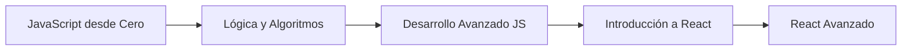

# 🚀 JavaScript Sesiones

> **Una travesía completa por el ecosistema JavaScript — desde los fundamentos hasta React Avanzado.**


---

## 📚 Módulos

| Módulo | Clases | Temas clave |
|--------|-------|-------------|
| [**JavaScript desde Cero**](./JavaScript-desde-Cero) | 8 | Tipos, operadores, condicionales, loops, arreglos, funciones, objetos, DOM, APIs |
| [**Lógica y Algoritmos**](./Logica%20y%20Algoritmos) | 8 | ES6+, Two Pointers, Sliding Window, Recursión, Divide & Conquer, Binary Search |
| [**Desarrollo Avanzado JS**](./Desarrollo-Avanzado-Javascript) | 6 | Event Loop, Callbacks, Fetch vs Axios, Promises, Formularios, Vite |
| [**Introducción a React**](./Introduccion-A-React) | 3 | Componentes, estado, router, context, autenticación |
| [**React Avanzado**](./React%20Avanzado) | 2 | Formularios tradicionales en React (en progreso) |

---

## 🗺️ Ruta de Aprendizaje



---

## 📂 Estructura del Proyecto

```
JavaScript-Sesiones/
├── JavaScript-desde-Cero/          # Fundamentos del lenguaje
│   ├── clase_1/                    # Tipos de datos
│   ├── clase_2/                    # Operadores y condicionales
│   ├── clase_3/                    # Arreglos y ciclos
│   ├── clase_4/                    # Funciones
│   ├── clase_5/                    # Objetos
│   ├── clase_6/                    # Introducción al DOM
│   ├── clase_7/                    # Generador de contraseñas
│   └── clase_8/                    # Librería de libros (API)
│
├── Logica y Algoritmos/            # Pensamiento computacional
│   ├── clase_1/                    # ES6 Moderno
│   ├── clase_2/                    # Algoritmo lista de compras
│   ├── clase_3/                    # Métodos avanzados de arreglos
│   ├── clase_4/                    # Two Pointers
│   ├── clase_5/                    # Sliding Window
│   ├── clase_6/                    # Recursión
│   ├── clase_7/                    # Divide & Conquer
│   └── clase_8/                    # Gestor de notas (Node.js)
│
├── Desarrollo-Avanzado-Javascript/ # JS asíncrono y herramientas
│   ├── clase_1/                    # Event Loop (cafetería)
│   ├── clase_2/                    # Callbacks y JSON
│   ├── clase_3/                    # Fetch vs Axios (Rick & Morty)
│   ├── clase_4/                    # Promesas y Async/Await
│   ├── clase_5/                    # Formularios con validación
│   └── clase_8/                    # Proyectos con Vite
│
├── Introduccion-A-React/           # El mundo de React
│   ├── clase_1/                    # Tarjeta de presentación
│   ├── clase_2/                    # Lista de compras (CRUD)
│   └── clase_8/                    # Chirp (Twitter Clone)
│
├── React Avanzado/                 # React a profundidad
│   ├── clase_1/                    # Formularios tradicionales
│   └── clase_02/                   # (próximamente)
│
├── .gitignore
├── opencode.json
└── README.md                       # ← Estás aquí
```

---

## 🏆 Proyectos Destacados

| Proyecto | Módulo | Tecnologías |
|----------|--------|-------------|
| [**Chirp**](Introduccion-A-React/clase_8/Proyecto) — Clon de Twitter | React | React 19, Router, Context, SHA-256 |
| [**Rick & Morty Explorer**](Desarrollo-Avanzado-Javascript/clase_03/Proyecto%20Fetch%20y%20Axios) | JS Avanzado | Fetch, Axios, REST API |
| [**Restaurant Reservation**](Desarrollo-Avanzado-Javascript/clase_4/ProyectoPromesasAsyncAwait) | JS Avanzado | Promises, Async/Await |
| [**Password Generator**](JavaScript-desde-Cero/clase_7) | JS desde Cero | DOM, Eventos |
| [**Book Library**](JavaScript-desde-Cero/clase_8) | JS desde Cero | Open Library API, DOM |
| [**Gestor de Notas CLI**](Logica%20y%20Algoritmos/clase_8) | Algoritmos | Node.js, JSON, fs |
| [**Business Card**](Introduccion-A-React/clase_1/proyecto-intro-react) | React | Componentes, Props |

---

## ⚡ Cómo Empezar

Cada proyecto en Vite se puede ejecutar con:

```bash
cd ruta-del-proyecto
npm install
npm run dev
```

> **Nota:** Los archivos individuales de JavaScript (`.js`) se pueden ejecutar directamente con Node.js o abriendo el `index.html` en el navegador.

---

## 🛠️ Tecnologías Usadas

- **Lenguajes:** JavaScript (ES6+), JSX
- **Librerías:** React 19, React Router DOM 7
- **HTTP:** Fetch API, Axios
- **Herramientas:** Vite, Node.js, ESLint
- **APIs externas:** Rick & Morty API, Open Library API

---

## 🎯 Objetivo

Este repositorio documenta el aprendizaje progresivo de JavaScript y su ecosistema, combinando **fundamentos teóricos**, **algoritmos clásicos**, **programación asíncrona**, y **desarrollo de aplicaciones web modernas con React**. Cada módulo incluye ejercicios prácticos y proyectos funcionales que refuerzan los conceptos aprendidos.

---

<div align="center">

**Hecho con 💛 por JoseBenin82 — Aprendiendo con DEV.F**

</div>
